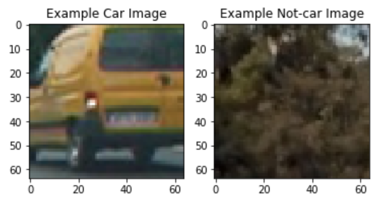
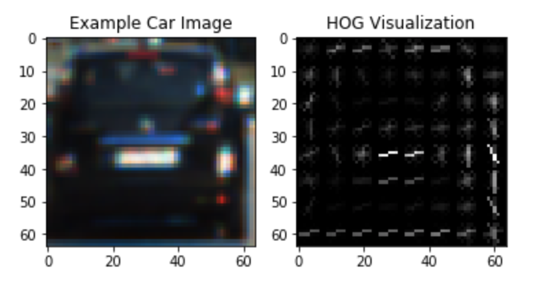
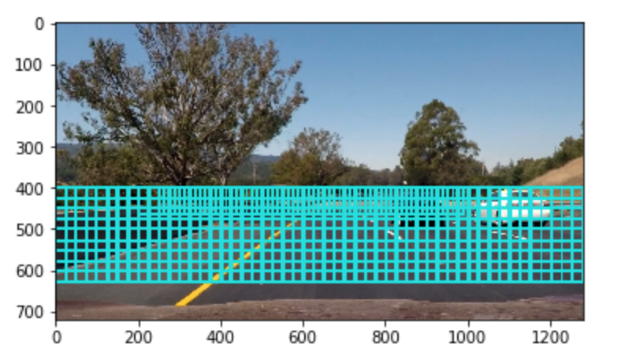
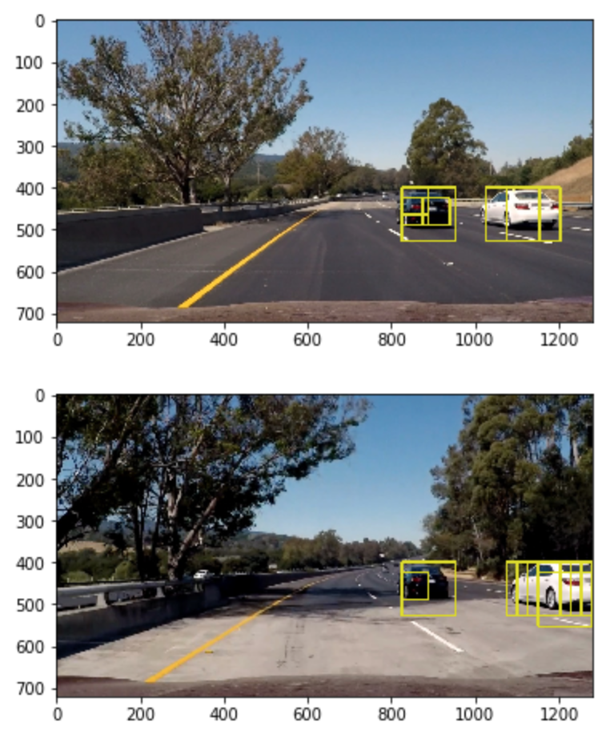
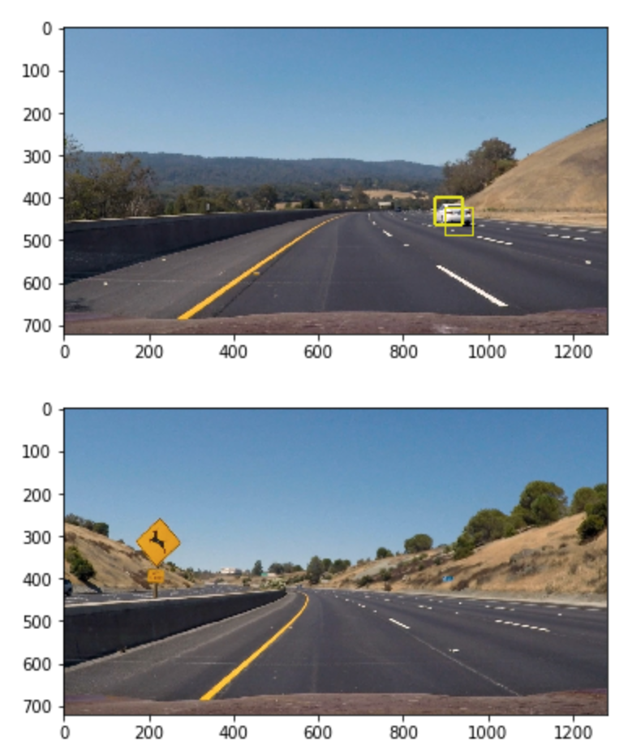
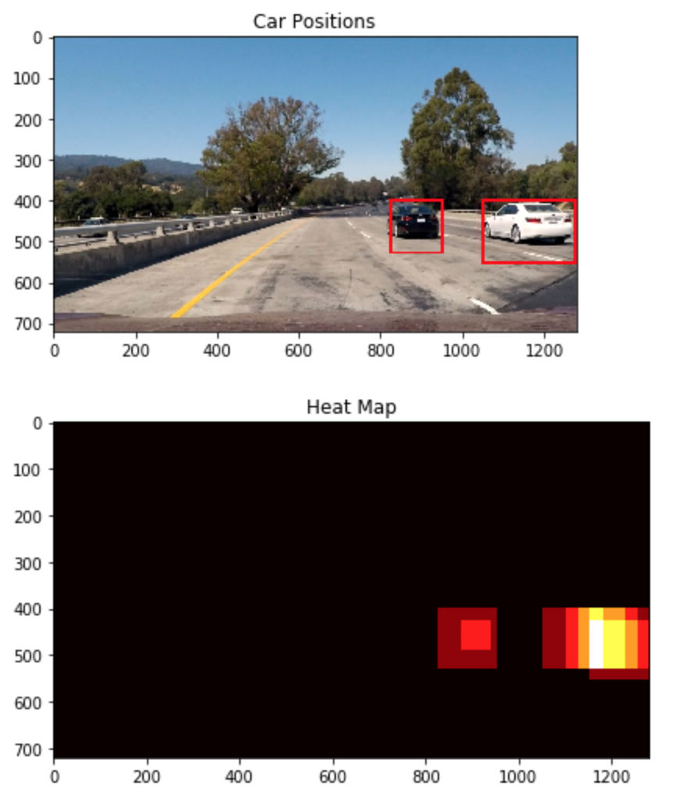
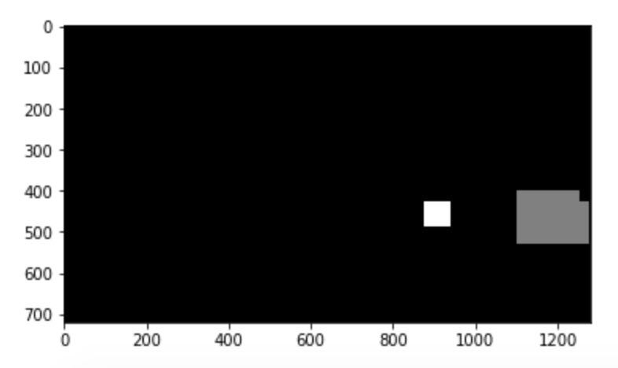
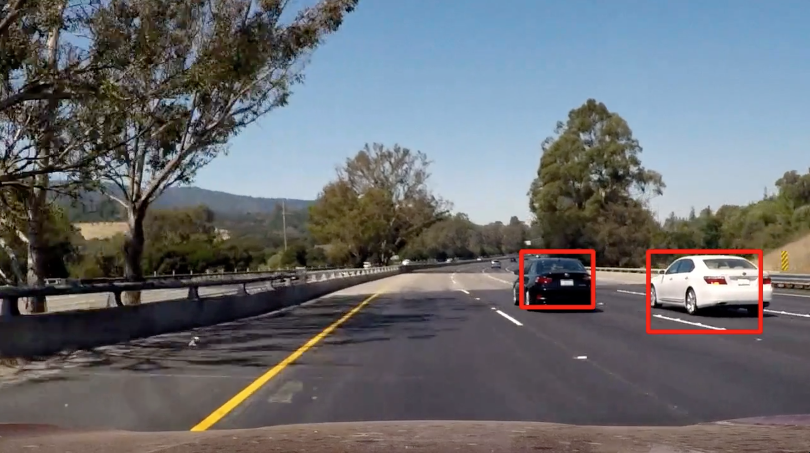

## **Vehicle Detection Project**

The goals / steps of this project are the following:

* Perform a Histogram of Oriented Gradients (HOG) feature extraction on a labeled training set of images and train a classifier Linear SVM classifier
* Optionally, you can also apply a color transform and append binned color features, as well as histograms of color, to your HOG feature vector.
* Note: for those first two steps don't forget to normalize your features and randomize a selection for training and testing.
* Implement a sliding-window technique and use your trained classifier to search for vehicles in images.
* Run your pipeline on a video stream (start with the test_video.mp4 and later implement on full project_video.mp4) and create a heat map of recurring detections frame by frame to reject outliers and follow detected vehicles.
* Estimate a bounding box for vehicles detected.

[//]: # (Image References)
[image1]: ./examples/car_not_car.png
[image2]: ./examples/HOG_example.jpg
[image3]: ./examples/sliding_windows.jpg
[image4]: ./examples/sliding_window.jpg
[image5]: ./examples/bboxes_and_heat.png
[image6]: ./examples/labels_map.png
[image7]: ./examples/output_bboxes.png
[video1]: ./project_video.mp4

## [Rubric](https://review.udacity.com/#!/rubrics/513/view) Points
### Here I will consider the rubric points individually and describe how I addressed each point in my implementation.  

---
### Writeup / README

#### 1. Provide a Writeup / README that includes all the rubric points and how you addressed each one.  You can submit your writeup as markdown or pdf.  [Here](https://github.com/udacity/CarND-Vehicle-Detection/blob/master/writeup_template.md) is a template writeup for this project you can use as a guide and a starting point.  

You're reading it!

### Histogram of Oriented Gradients (HOG)

#### 1. Explain how (and identify where in your code) you extracted HOG features from the training images.

The code for this step is contained in the first code cell of the IPython notebook (./Project.ipynb).  

I started by reading in all the `vehicle` and `non-vehicle` images.  Here is an example of one of each of the `vehicle` and `non-vehicle` classes:



I then explored different color spaces and different `skimage.hog()` parameters (`orientations`, `pixels_per_cell`, and `cells_per_block`).  I grabbed random images from each of the two classes and displayed them to get a feel for what the `skimage.hog()` output looks like.

Here is an example using the greyscale color space and HOG parameters of `orientations=9`, `pixels_per_cell=(8, 8)` and `cells_per_block=(2, 2)`:



#### 2. Explain how you settled on your final choice of HOG parameters.

The code for this step is contained in the 2 section of the IPython notebook (./Project.ipynb).

LUV decouple the "color" (chromaticity, the UV part) and "lightness" (luminance, the L part) of color. Thus in object detection, it is common to match objects just based on the UV part, which gives invariance to changes in lighting condition.

I tried various combinations of parameters and chose the following parameter set.
```
#Parameter tuning
color_space = 'LUV' # Can be RGB, HSV, LUV, HLS, YUV, YCrCb
orient = 8  # HOG orientations
pix_per_cell = 8 # HOG pixels per cell
cell_per_block = 2 # HOG cells per block
hog_channel = 0 # Can be 0, 1, 2, or "ALL"
spatial_size = (16, 16) # Spatial binning dimensions
hist_bins = 32    # Number of histogram bins
spatial_feat = True # Spatial features enable
hist_feat = True # Histogram features enable
hog_feat = True # HOG features enable
```

#### 3. Describe how (and identify where in your code) you trained a classifier using your selected HOG features (and color features if you used them).

The code for this step is contained in the 3 section of the IPython notebook (./Project.ipynb).

The following septs were made to train classifier
- Create an array stack of feature vectors
- fulfil the stack with standard scaler prcessed features, which were extracted based on HOG feature, bin spatial, and color histogram.
- Shuffle the dataset, and randomly split the dataset(feature stack) to training set(80%) and test set (20%)
- Use a linear SVC , and train the SVC

The summary of the trained SVC classifier:
```
Car samples:  8792
Notcar samples:  8968
Using: 8 orientations 8 pixels per cell and 2 cells per block
Feature vector length: 2432
3.53 Seconds to train SVC...
Test Accuracy of SVC =  0.984
```

### Sliding Window Search

#### 1. Describe how (and identify where in your code) you implemented a sliding window search.  How did you decide what scales to search and how much to overlap windows?

The code for this step is contained in the 4.1 section of the IPython notebook (./Project.ipynb).

I focused on the area of road. It leads to the set of ROI to be  ` y_start_stop=[400, 640]`. Considering the image size of vehicle, the window size was set to `xy_window=(128, 128)`
To follow the tracking of vehicle smoothly, I preferred to use a high overlap rate. After a few try, the overlap rate = 80% turns to the best result.

As you seen, all the windows have been visualised in blue boxes:



#### 2. Show some examples of test images to demonstrate how your pipeline is working.  What did you do to optimize the performance of your classifier?

Ultimately I searched using LUV L-channel HOG feature plus spatially binned color and histograms of color in the feature vector, which provided a nice result.  

To detect the vehicle in far distance, a set of smaller window `xy_window=(64, 64)` were also scanned between the `y_start_stop=[400, 500]`. Overlap rate was set to 60%.

Here are some example images:



---

### Video Implementation

#### 1. Provide a link to your final video output.  Your pipeline should perform reasonably well on the entire project video (somewhat wobbly or unstable bounding boxes are ok as long as you are identifying the vehicles most of the time with minimal false positives.)
Here's a [link to my video result](./project_video_output.mp4)


#### 2. Describe how (and identify where in your code) you implemented some kind of filter for false positives and some method for combining overlapping bounding boxes.

The code for this step is contained in the 5.2 section of the IPython notebook (./Project.ipynb).

Given window slide feature extraction, I recorded the positions of positive detections in each frame of the video.  From the positive detections I created a heat-map for each frame. To control the false positive, a filter was made. The filter first sum up the heat-map of last few frames, and then thresholded that map to identify vehicle positions.  I then used `scipy.ndimage.measurements.label()` to identify individual blobs in the heatmap.  I then assumed each blob corresponded to a vehicle.  I constructed bounding boxes to cover the area of each blob detected.  

Parameters I used on window slide:  
ystart, ystop, xstart, xstop, scale, step  
400, 650, 640, 1280, 2.0, 2  
380, 500, 640, 1280, 1.5, 1  
thresholded: 2  
filter frames: 16


### Here is a example of heatmap:



### Here is the output of `scipy.ndimage.measurements.label()` of above heatmap:


### Here the resulting bounding boxes are drawn onto a frame in test_video:



---

### Discussion

#### 1. Briefly discuss any problems / issues you faced in your implementation of this project.  Where will your pipeline likely fail?  What could you do to make it more robust?

1. Randomly false positive from SVC classifier  
solution: Vehicle will not suddenly appear or disappear. A filter  with considering multiple frames can delete most of those errors.

2. Cars overlapped by highway guardrails can not be detected. Cars overlapped by another car are hard to be detected.
Potential solution: Train the SVC classifier with larger dataset or add data augmentation which includes samples of overlapped cars. May also consider using RNN classifier as an extra classifier.

3. The algorithm is too slow to run in real-time.
Potential solution: Optimize the calculation of the algorithm.  Tuning the parameters(number of windows, num of HOG features, overlap rate, etc...) to increase the speed while keep the performance.
